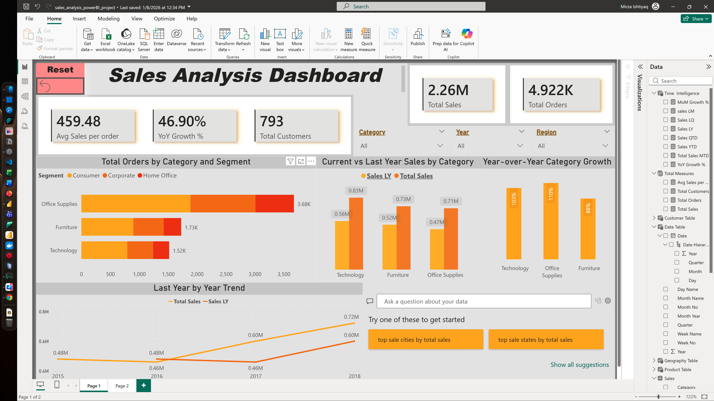

# 📊 Power BI Sales Analytics Dashboard

> A comprehensive end-to-end analytics solution combining **Azure Fabric**, **Spark SQL**, **Excel**, and **Power BI** with a logic-first analytical approach.

This project demonstrates a complete analytics workflow designed for business intelligence and data-driven decision-making.

## Project Overview



The dashboard provides actionable insights into:
- **Total Sales, Orders, and Customers** – Key business metrics at a glance
- **Year-over-Year (YoY) & Last-Year (LY) Analysis** – Performance trends and growth tracking
- **Category-wise Sales Growth** – Segment performance and comparative analysis
- **Business-Ready KPIs** – Optimized metrics for executive decision-making

## 🛠️ Tools & Technologies

| Technology | Purpose |
|-----------|---------|
| **Azure Fabric** | Cloud-based data management and analytics platform |
| **Spark SQL** | Distributed data transformation and querying |
| **Microsoft Excel** | Data validation, exploratory analysis, and support |
| **Power BI** | Data modeling, DAX calculations, and visualization |

## 📁 Repository Structure

```text
├── Dashboard/
│   ├── sales_analysis_powerBI_project.pbix
│   └── README.md
├── Images/
│   ├── Dashboard.jpg
│   ├── Excel Analysis.jpg
│   ├── Table.jpg
│   └── README.md
└── README.md
```

## 🎯 Key Features

- **Interactive Dashboards** – Dynamic slicers and filters for real-time analysis
- **Time Intelligence** – Proper Date table for YoY and trend comparisons
- **Multi-Dimensional Analysis** – Category, segment, and product-level insights
- **Data Validation** – Excel-backed analysis ensuring accuracy
- **Scalable Architecture** – Built on Azure Fabric for enterprise-grade performance

## 📈 Dashboard Highlights

- Real-time KPI tracking
- Comparative performance metrics
- Interactive drill-down capabilities
- Business-focused visualization

## 🚀 Getting Started

1. **Download** the Power BI file (`sales_analysis_powerBI_project.pbix`) from the Dashboard folder
2. **Connect** to your data source via Azure Fabric
3. **Explore** the interactive visualizations and KPIs
4. **Customize** the DAX measures and filters as needed

## 📝 Project Approach

This dashboard follows a **logic-first methodology**, prioritizing:
- Business logic and requirements before visualization
- Data accuracy and validation
- Scalable and maintainable code structure
- User-focused analytics

## 📧 Contact & Support

For questions or suggestions, feel free to reach out!

---

**Last Updated:** June 2026 | **Status:** Production Ready
